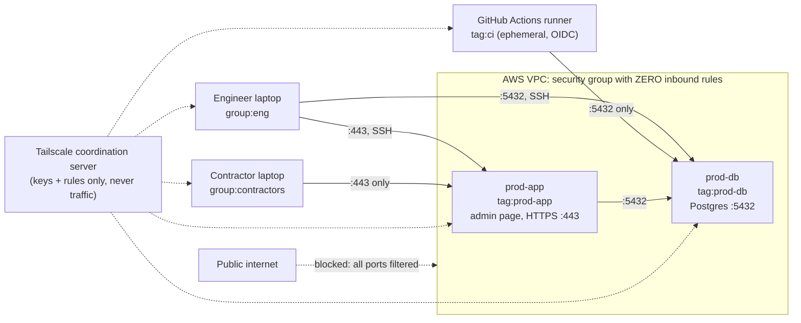

# Zero Open Ports: Tailscale for a Small Healthcare SaaS

**Tailnet:** `taila8a920.ts.net`

## Overview

Meridian Health Analytics is a fictional 30-person healthcare-data company preparing for its first SOC 2 audit. Today it has the usual small-company setup: a bastion host with SSH open to the internet, an admin app behind an IP allowlist, a CI job that needs a firewall hole to reach the database, and a contractor who was given full VPN access.

This project rebuilds that environment with Tailscale so that **no production server accepts any inbound connection from the internet**, and access is decided by **who you are** (identity) and **what a machine is** (tags), not by IP address. Every rule lives in this repo, is applied by Terraform, and is guarded by tests that reject unsafe changes.

## Why this use case

Commercial buyers rarely ask for "a VPN." They ask:

- **Who can reach production right now?** Answered by one reviewed policy file.
- **How do we remove access when someone leaves?** Remove them in the identity provider; there are no keys or firewall entries to clean up.
- **Can CI deploy without a long-lived secret?** Yes: GitHub Actions joins with its own signed identity token.
- **What's exposed to the internet?** Nothing. A port scan of both servers' public IPs finds no open ports.

That combination (smaller attack surface, faster offboarding, audit evidence, and less infrastructure than the bastion it replaces) is the business value.

## Architecture



### Access model

| From | To | Result |
|---|---|---|
| `group:eng` | prod-app :443, :22 · prod-db :5432, :22 | Allowed |
| `group:contractors` | prod-app :443 | Allowed |
| `group:contractors` | prod-db (any port), SSH anywhere | Denied (prod-db isn't even visible) |
| `tag:ci` | prod-db :5432 | Allowed |
| `tag:ci` | prod-app, SSH anywhere | Denied |
| `tag:prod-app` | prod-db :5432 | Allowed |
| Public internet | any port on either server | Denied |

Everything not listed is denied by default. SSH is **Tailscale SSH**: engineers only, as `ubuntu`, in **check mode** (requires a recent login). **No SSH keys exist for either server.**

### How traffic flows

1. Each server boots, joins the tailnet with a **single-use, one-hour, tagged** key, and opens only an outbound connection to Tailscale's coordination server.
2. The coordination server sends each machine the list of peers it may talk to, with their keys. A machine never learns about peers it can't reach.
3. Peers connect directly using NAT traversal, or via a Tailscale relay (DERP) if they can't. Either way, traffic is end-to-end encrypted with WireGuard; relays only see ciphertext.
4. The receiving machine drops anything the policy doesn't allow.
5. MagicDNS provides names (`prod-db`), and Tailscale issues a real HTTPS certificate for `prod-app.taila8a920.ts.net`. The admin page shows the viewer's identity from Tailscale with no separate login.

### CI without a stored Tailscale secret

`.github/workflows/migrate.yml` requests a GitHub-signed identity token, exchanges it with Tailscale for a short-lived key, joins as an **ephemeral `tag:ci` node**, runs the database migration, verifies it **cannot** reach the admin app or SSH, and leaves the tailnet when the job ends. The trust rule (`terraform/ci.tf`) only accepts tokens from this exact repo and branch, **pinned by GitHub's numeric owner and repo IDs**, so a deleted-and-recreated repo with the same name is not trusted.

## Repository layout

| Path | Purpose |
|---|---|
| `policy/policy.hujson` | Groups, tag owners, grants, SSH rules, `tests`, `sshTests` |
| `terraform/policy.tf` | Applies the policy file to the tailnet |
| `terraform/network.tf` | VPC, subnet, and security group with no inbound rules |
| `terraform/db.tf`, `terraform/app.tf` | The two servers and their single-use tagged join keys |
| `terraform/cloud-init/` | First-boot scripts (install Tailscale, Postgres, the admin page) |
| `terraform/ci.tf` | GitHub Actions federated identity for `tag:ci` |
| `terraform/check.tf` | Smoke-test outputs (AWS identity, device count) |
| `.github/workflows/migrate.yml` | CI migration over Tailscale, with self-checks |
| `migrations/` | SQL migrations |
| `scripts/validate.sh` | Allowed/denied matrix per identity, plus public-IP probes |
| `evidence/` | Saved outputs and screenshots from the validation runs |

## Assumptions

- Meridian is fictional. GitHub logins stand in for a corporate identity provider (Okta or Entra ID in a real deployment).
- Built on Tailscale's free plan. Features that need a paid plan are noted where they come up.
- The servers have public IPs only so they can reach the internet outbound (no NAT gateway, to keep cost low). The security group allows **no** inbound traffic.
- Postgres listens on all interfaces, but only tailnet addresses (`100.64.0.0/10`) are allowed to log in, and the firewall blocks everything else.
- The environment stays running so reviewers can see the tailnet.

## Prerequisites

- An AWS account (sandbox) and a CLI profile. Built in **us-east-2**, because the sandbox organization's service control policy only allows that region.
- A new tailnet (Free plan is sufficient), plus two GitHub identities: an engineer (tailnet admin) and a contractor.
- Terraform ≥ 1.6, AWS CLI, GitHub CLI, `nc`, `curl`, `python3`. `nmap` is optional.

## Setup

1. **Tailnet settings (manual, one-time):** in the admin console, confirm MagicDNS is on and enable **HTTPS Certificates** under DNS.
2. **Identities:** put your engineer and contractor login names (`<github-username>@github`) in `policy/policy.hujson`, in both the groups and the tests.
3. **CI trust:** set the `subject` in `terraform/ci.tf` to your repo. GitHub's format is `repo:<owner>@<owner-id>/<repo>@<repo-id>:ref:refs/heads/main`; the exact value appears in the admin console's Trust credentials page after a first failed attempt.
4. **Credentials (never committed):**
```sh
   export AWS_PROFILE=<sandbox-profile>
   export TAILSCALE_API_KEY=<tailnet API access token>
```
5. **Build:**
```sh
   cd terraform
   terraform init
   terraform apply
```
6. **CI settings** (values come straight from Terraform):
```sh
   gh secret set TS_OAUTH_CLIENT_ID --body "$(terraform output -raw ci_client_id)"
   gh secret set TS_AUDIENCE        --body "$(terraform output -raw ci_audience)"
   gh secret set DB_PASSWORD        --body "$(terraform output -raw db_password)"
```
7. **Contractor:** invite the contractor from the admin console's Users page, and have them join **this** tailnet (not their own personal one).
8. **Teardown:** `terraform destroy`.

## Validation

Run `scripts/validate.sh` once as each identity (`tailscale switch <account>`). CI rows run inside GitHub Actions.

| # | Check | Expected | Result |
|---|---|---|---|
| 1 | Engineer → prod-app :443 (HTTPS) | allow | ✅ |
| 2 | Engineer → prod-db :5432 | allow | ✅ |
| 3 | Engineer → Tailscale SSH to prod-db and prod-app | allow | ✅ |
| 4 | Contractor → prod-app :443 | allow | ✅ |
| 5 | Contractor → prod-db (by name, and by IP on :5432) | deny | ✅ |
| 6 | Contractor → prod-app :22 | deny | ✅ |
| 7 | CI → prod-db :5432 (migration applied) | allow | ✅ |
| 8 | CI → prod-app :443 | deny | ✅ |
| 9 | CI → prod-db :22 | deny | ✅ |
| 10 | Internet → both servers' public IPs (22, 443, 5432, 8080) | deny | ✅ |
| 11 | prod-app → prod-db :5432 | allow | ✅ |

Additional proof:
- **Policy tests reject unsafe changes.** Adding a grant that gave the contractor database access was refused by Tailscale (`test(s) failed (400)`) and never went live.
- **Full port scan:** all 1,000 common TCP ports on prod-db's public IP are filtered (`evidence/nmap-public-ip.txt`).
- **Ephemeral CI node:** present only during the job, then removed automatically.
- **No drift:** `terraform plan` reports no changes after apply.

Evidence files: `evidence/validate-engineer.txt`, `evidence/validate-contractor.txt`, `evidence/ci-run.txt`, `evidence/contractor-denials.txt`, `evidence/nmap-*.txt`, plus screenshots.

## What worked well

- **Policy tests** make access rules safe to change in pull requests: a bad rule can't be saved.
- **Zero inbound rules, still direct connections.** Tailscale's NAT traversal established direct paths through AWS's stateful firewall without opening any port (`tailscale status` showed `direct ...:41641`). Some connections used a relay first.
- **Identity everywhere:** the admin page displays the viewer's identity from Tailscale with no login system to build.
- **Two independent layers of denial:** the contractor's SSH attempts were dropped at the network layer before Tailscale's SSH rules were even consulted.

## What was difficult or surprising

- **GitHub's OIDC subject now includes numeric IDs** (`owner@id/repo@id`). My first trust rule used the older name-only format and was rejected. The admin console showed the exact received subject, which made the fix quick, and the ID-pinned form is safer.
- **Tailscale identifies GitHub users as `username@github`, not by email.** My first policy used email addresses, and its tests still passed, because tests check the policy against itself, not against real logins. Live checks matter.
- **One identity can belong to several tailnets.** The contractor's first sign-in joined their own personal tailnet instead of Meridian's, so it saw nothing.
- **Check mode didn't prompt** because the engineer had logged in within the default 12-hour window. Shortening that window needs a paid plan.
- **macOS `nc -w`** doesn't bound connect time; dropped packets waited ~75 s until I added `-G`.
- **Tailscale PAM** (beta, access approved) writes its own entries into the same policy file. A GitOps-managed tailnet must merge those into the repo, or the next `terraform apply` removes them.

## What I'd do with more time

- **Tailscale PAM** for the database: no standing credentials, read-only roles, approvals, and session logs. CI still holds one real secret (`DB_PASSWORD`); PAM would remove it.
- **Device posture** via the Iru (Kandji) integration (paid plans): only managed devices can reach production.
- **Remote Terraform state** (S3 with locking) and a least-privilege IAM role instead of a broad sandbox admin user.
- **Run `validate.sh` in CI** on every policy change, and add the policy file to a pull-request review flow (GitOps).
- **A real identity provider** (Okta or Entra ID) instead of GitHub logins, so offboarding is driven by HR systems.
- **A clean destroy-and-rebuild run** in a fresh account to prove reproducibility end to end, and a bump of `actions/checkout` to v5.

## AI assistance

I used Claude (Anthropic) as a guide throughout: choosing the use case, structuring the access model, Terraform and policy syntax, the CI workflow, and the validation script. I typed and ran every command, created every file, and reviewed each output before moving on.

**What I reviewed or changed myself:**
- Chose to keep the full scope (CI, contractor, validation script) rather than cut it for time.
- Set up the separation myself: a dedicated tailnet, two GitHub identities, and a sandbox AWS account kept apart from my personal and work environments.
- Worked through real problems as they came up: the AWS organization's region lock (moved the build to us-east-2), the contractor joining the wrong tailnet, files made root-owned by opening them with sudo, and a credentials file that landed in the repo folder (removed before it was ever committed).
- Checked real output before every next step: Terraform plans before applying, `git status` before every commit, and a scan of the full git history for secrets before making the repo public.
- Reviewed and edited this README.

Where it was wrong, incomplete, or misleading:
- It wrote the first policy with email addresses instead of `username@github` login names.
- Its first CI trust rule used GitHub's older subject format; the admin console's error showed the correct one.
- It used `nc -w` for timeouts, which doesn't work for connection attempts on macOS.
- It didn't initially make clear that no HashiCorp account is needed for local Terraform, or how to keep the demo tailnet separate from my existing personal one.
- It miscounted a Terraform plan (said 10 resources; it was 9).

Where it was most helpful: catching mismatches early (login names, the wrong tailnet, a secrets file in the repo folder) and explaining each mechanism in plain language before building it.